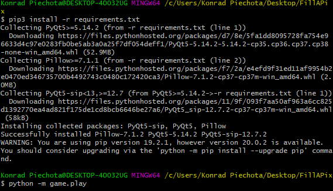
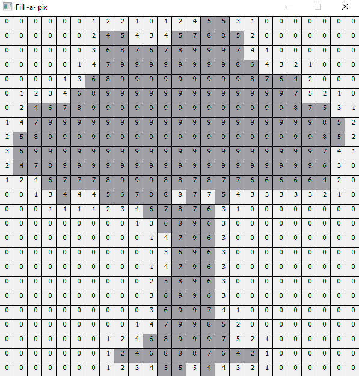

### Testlink
W ramach zadania z Testlinka testowana była funkcjonalność logowania na stronę wiki.e-science.pl oraz zostały napisane testy jednostkowe do gry fill-a-pix
wykonanej w ramach laboratorium 7. Wynik z tych testów wysyłany jest automatycznie do testlinka. Raport znajduje się w pliku pdf. 

>### Gra Fill-a-Pix
>W celu uruchomienia gry w pierwszej kolejności należy upewnić się, że zainstalowane są odpowiednie moduły.
>Znajdując się w katalogu z grą można to zrobić komendą
>
>``` pip install -r requirements.txt ```
>
>Brakujące moduły zostaną pobrane.
>
>
>Następnie można włączyć grę za pomocą komendy:
>``` python -m game.play ```
>
>
>
>
>Zostanie uruchomione menu gry, w którym należy wprowadzić - liczbę kolumn i wierszy (liczby całkowite), oraz lokalizację dowolnego pliku graficznego, za pomocą przycisku 'Wybierz plik'. Można wykorzystać przykładowe obrazy: tree.png lub house.png.
>
>Zasady gry:
>
>https://www.conceptispuzzles.com/index.aspx?uri=mobile/100001
>
>Wskazywanie zamalowanego pola odbywa się poprzez kliknecie klawiszem myszy w odpowiednia komórkę.
>
>Próba zamalowania nieodpowiedniej komórki poskutkuje pojawieniem się komunikatu o błędzie.
>
>Gdy wszystkie komórki zostaną zamalowane pojawi się informacja o końcu gry.
>
>
>Przykład uzupełnionej planszy:
>
>